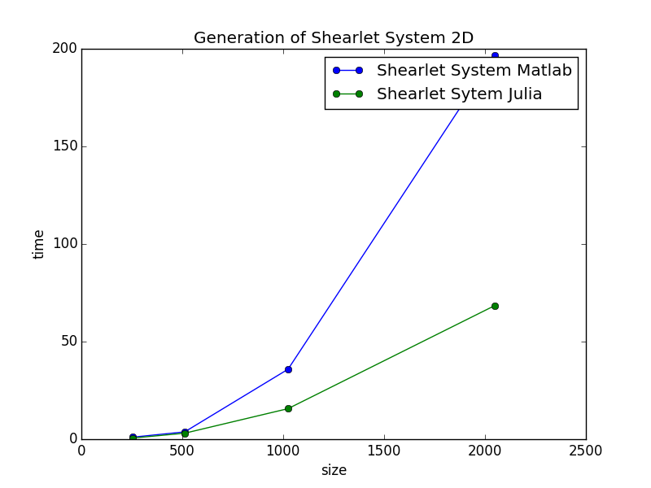
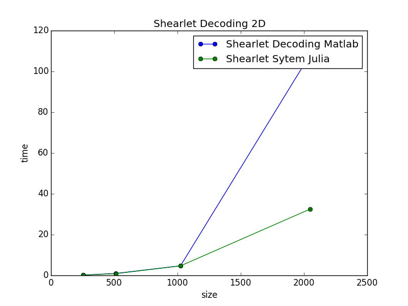
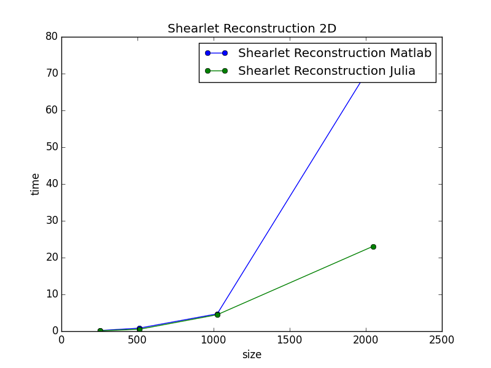

### 
 Benchmarks on Shearlet System Generation Decoding and Reconstruction. 

- **2D version.**

| Benchmark     |    Matlab(seconds)     |    Julia(seconds)     | Improvement rate |
|:-------------:|:-------------:|:------------:|:----------------:|
| Shearlet System 256x256 | 1.06 | 0.61 | 1.73 |
| Decoding 256x256 | 0.18 | 0.15 | 1.2 |
| Reconstruction 256x256 | 0.18 | 0.12 | 1.5 | 
| Shearlet System 512x512 | 3.75 | 3.07 | 1.22 |
| Decoding 512x512 | 0.96 | 0.87 | 1.10 | 
| Reconstruction 512x512 | 0.84 | 0.52 | 1.62 | 
| Shearlet System 1024x1024 | 35.84 | 15.65 | 2.29 |
| Decoding 1024x1024 | 4.70 | 4.67 | 1.01 |
| Reconstruction 1024x1024 | 4.72 | 4.48 | 1.05 |
| Shearlet System 2048x2048 | 196.69 | 68.43 | 2.87 |
| Decoding 2048x2048 | 108.19 | 32.50 | 3.33 |
| Reconstruction 2048x2048 | 73.20 | 23.08 | 3.17 |

- **Benchmarks plots 2D**.

In the next plots one can see that in the 2D case Julia's version of Shearlab is way more scalable than the matlabs version

